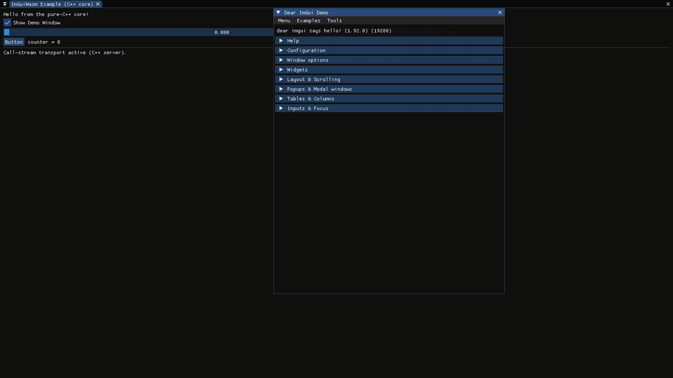

# ImGuiQuic

A native Dear ImGui backend for the browser. Write ordinary C++ `ImGui::` calls;
the application sends exact draw data over WebTransport and the browser renders it
with WebGL. QUIC/TLS runs in the application through Google QUICHE and BoringSSL.



## Start

Requires Linux x86-64 or AArch64, Git, CMake 3.21+, a C++17 compiler,
Clang with C++20 support, ICU development files. Dear ImGui and
QUICHE are pinned and downloaded by the build; the first build takes longer.
Use a WebTransport-capable browser with UDP access to the server.
The C++ development launcher requires the OpenSSL CLI.

```bash
cmake -S . -B build -DCMAKE_BUILD_TYPE=Release -DIMGUI_QUIC_BUILD_EXAMPLES=ON -DIMGUI_QUIC_BUILD_TESTS=ON
cmake --build build -j 6
./build/examples/imgui_quic_dev --example minimal
```

In another terminal, serve the frontend with your preferred static host. For local development:

```bash
npx --yes http-server frontend -a 127.0.0.1 -p 8888 -c-1
```

Open the URL saved to `build/webtransport_dev/url.txt`. It contains a private
development token; keep it local. The native process listens only on UDP `127.0.0.1:4433`.
The frontend is hosted separately. Ctrl-C stops each development process.
Use `--example demo` for docking, widgets, clipboard and media examples.

With CMake 3.21+, `cmake --preset dev`, `cmake --build --preset dev` and
`ctest --preset dev` provide the same development configuration.

## Write your application

Start with [examples/minimal.cpp](examples/minimal.cpp). The example process
setup lives in [examples/support.hpp](examples/support.hpp); the UI needs only:

```cpp
int clicks = 0;
auto ui = app.on_render([&] {
    ImGui::Begin("Hello");
    if (ImGui::Button("Click me")) ++clicks;
    ImGui::Text("Clicks: %d", clicks);
    ImGui::End();
});
```

The C++ configuration selects the QUIC listener:

```cpp
imgui_quic::Config config;
config.address = "127.0.0.1";
config.port = 4433;
imgui_quic::Server app;
app.init(config);
```

`app.init()` uses these defaults. Transport startup reads credentials from
`IMGUI_QUIC_CERT`, `IMGUI_QUIC_KEY`, `IMGUI_QUIC_TOKEN_FILE` and
`IMGUI_QUIC_ORIGINS`; without `IMGUI_QUIC_CERT`, it initializes the rendering
core only. The development launcher supplies these variables to the example.

Keep the callback handle alive and call `app.render()` from your application
loop. The server owns the native ImGui context. Server shutdown joins the QUIC endpoint automatically.
See the [transport setup guide](tools/webtransport/README.md) for the public
`imgui_quic_start()` API and production credentials.

Embed with `add_subdirectory` or consume an installed package:

```cmake
find_package(imgui_quic CONFIG REQUIRED)
target_link_libraries(my_app PRIVATE imgui_quic::core)
```

## Project map

| Directory | Responsibility |
| --- | --- |
| `include/` | Public lifecycle, C++ wrapper, texture/media/QUIC APIs and generated C bindings |
| `src/` | Private state, input scheduling, draw encoding and native ImGui backend |
| `transport/quiche/` | Private HTTP/3 and QUIC adapter |
| `frontend/` | WebTransport connection, exact draw decoder and WebGL renderer |
| `examples/` | Minimal starter and complete interactive demo |
| `tests/` | Native protocol, browser and native WebTransport regressions |
| `cmake/` | Dependency setup, QUIC build and package installation |
| `tools/` | Launcher, binding generator, upstream maintenance and benchmarks |

The data path is `ImGui → draw snapshot → acknowledged I/P encoder → QUIC →
browser decoder → WebGL`. Input returns to the shared native context. Small
P frames and pointer movement use datagrams; resources, critical input and large
frames use reliable streams. Motion deltas preserve the exact original bytes.

Clients share one UI context and layout. There is no browser prediction;
interaction incurs network latency. The browser uses WebTransport exclusively.

## Develop

```bash
ctest --test-dir build --output-on-failure
node tests/browser/draw_ip.mjs
node tests/browser/webtransport.mjs
node tests/browser/clipboard_shortcuts.mjs
node tests/browser/large_clipboard_batch.mjs
node tests/browser/media_viewer.mjs
```

Browser regressions require Node 22+. Reload the separately hosted frontend after editing its assets.
See [CONTRIBUTING](CONTRIBUTING.md) for binding generation, package installation
and validation; [transport design](docs/transport.md) for wire semantics, media
and tradeoffs; and [benchmarks](tools/benchmarks/README.md) for measurement.

This is early-stage software. Remote deployments require trusted TLS, HTTPS,
a token and an exact Origin allowlist. Read [SECURITY](SECURITY.md) before
exposing a service. Development certificates are for local use.

[MIT license](LICENSE). Dependency notices are in
[THIRD_PARTY_NOTICES](THIRD_PARTY_NOTICES.md); changes are in [CHANGELOG](CHANGELOG.md).
